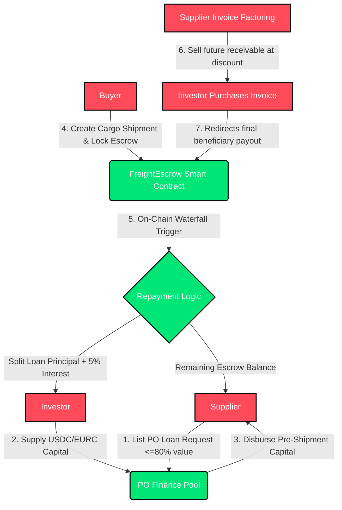
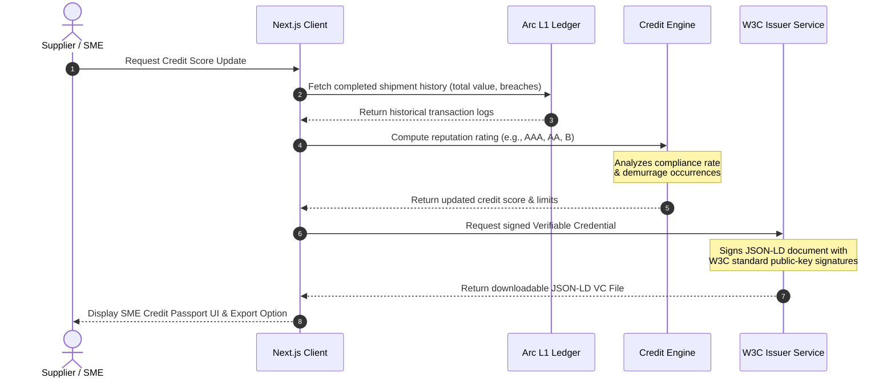

# FreightX — Logistics & Trade Finance Orchestrator 🚢

> **Track 2: Best SME Trade Finance & Working Capital Workflow**  
> An end-to-end stablecoin-powered logistics escrow, invoice factoring, and pre-shipment financing platform built on **Arc Network** using **Circle's USDC & EURC**.

---

## 🎯 Executive Summary & Problem Space

International trade and cross-border logistics are the lifeblood of the global economy, yet small and medium enterprises (SMEs) are strangled by a multi-trillion dollar **trade finance gap**. 

```
 Traditional Trade Finance Bottlenecks:
 ┌──────────────────────┐   ┌──────────────────────┐   ┌──────────────────────┐
 │  Bill of Lading Delay│ ─▶│ Working Capital Lock │ ─▶│ Expensive Middlemen  │
 │ Manual paper audits  │   │ SMEs wait 30-90 days │   │ L/Cs cost 1.5-3% and │
 │ take weeks to settle │   │ for bank processing  │   │ take 5-15 bank days  │
 └──────────────────────┘   └──────────────────────┘   └──────────────────────┘
```

**FreightX** fundamentally replaces traditional banking rails with **programmable stablecoin escrow smart contracts** and **dynamic liquidity markets** running natively on the **Arc L1 Network**. By utilizing USDC as the native gas token and leveraging Circle's digital asset suite, FreightX reduces settlement delays from 15 days to sub-second finality, reduces intermediary fees from 3% to a tiny 0.25% platform fee, and unlocks global capital pools to finance supplier purchase orders in real-time.

---

## 🏛️ Platform Topology & Technical Blueprint

FreightX utilizes a hybrid, modular architecture that integrates real-time web layers with on-chain financial settlement.

```
                  ┌─────────────────────────────────────┐
                  │          FreightX Client UI         │
                  │    (Next.js 15 SSR / Tailwind)      │
                  └──────────────────┬──────────────────┘
                                     │
           ┌─────────────────────────┴─────────────────────────┐
           ▼                                                   ▼
┌─────────────────────────────┐                     ┌─────────────────────────────┐
│    Off-Chain Telemetry      │                     │     On-Chain EVM Ledger     │
│   - IoT Oracle Simulator    │                     │   - FreightEscrow.sol       │
│   - W3C VC Signing Engine   │                     │   - FreightPassport.sol NFT │
│   - Supabase Query Cache    │                     │   - Circle USDC & EURC Rails│
└─────────────────────────────┘                     └─────────────────────────────┘
```

### Architectural Decisions & System Tradeoffs
1. **Direct Smart Contract Interaction via Viem/Wagmi**:
   * *Rationale:* Bypassing standard centralized gateway APIs ensures complete transparency. Buyers, suppliers, and carriers interact directly with the smart contract ledger, meaning payment triggers are strictly non-custodial and trustless.
   * *Tradeoff:* Requires client browsers to interact directly with the Arc L1 RPC nodes. To optimize UX during temporary RPC congestion, we implement an intelligent local state fallback cache.
2. **Dual Stablecoin Settlements (USDC & EURC)**:
   * *Rationale:* Trade corridors between the Gulf and Europe rely heavily on both USD and EUR equivalents. We natively integrate both USDC and EURC inside the `FreightEscrow.sol` contract, allowing users to choose their currency per shipment.
3. **ERC-721 Cargo Passports for Digital Twin Tracking**:
   * *Rationale:* Representing each cargo container as a unique, non-fungible token (`FreightPassport.sol`) allows us to bind dynamic logs (such as temperature breaches, location checkpoints, and customs stamps) directly to the on-chain digital twin.

---

## 🔗 Protocol Integrations & Web3 Ledger Specs

The smart contract ledger is deployed on the **Arc L1 Network**—where USDC serves as the native gas token. This provides key operational advantages:
* **Predictable Fees:** Every transaction cost is represented directly in dollar values, allowing shippers to forecast overhead with 100% accuracy.
* **Sub-Second Finality:** Checkpoint triggers and milestone payouts confirm in less than **0.8 seconds**, preventing shipping delays at port custom stations.
* **Frictionless Onboarding:** Carriers and suppliers receive payments without needing to manage separate native blockchain gas tokens.

### Core Smart Contracts
* **[FreightEscrow.sol](file:///E:/Airdrop%20ARC/Agora%20Hackathon%20-%2050k%20USDC/FreightX/contracts/FreightEscrow.sol):** Manages multi-currency escrows, milestone-based payout percentages, demurrage penalties, pre-shipment PO loan pools, and invoice factoring redirections.
* **[FreightPassport.sol](file:///E:/Airdrop%20ARC/Agora%20Hackathon%20-%2050k%20USDC/FreightX/contracts/FreightPassport.sol):** An ERC-721 contract representing each cargo container, holding historical telemetry data, status updates, and temperature violations.

---

## 📊 High-Level Data Pipelines (Mermaid)

### 1. Transshipment Settlement Engine & IoT Demurrage State Machine

```mermaid
flowchart LR
    classDef state fill:#f9f9f9,stroke:#090A0C,stroke-width:1px,color:#090A0C;
    classDef contract fill:#0088ff,stroke:#090A0C,stroke-width:2px,color:#fff;
    classDef oracle fill:#FF5A36,stroke:#090A0C,stroke-width:2px,color:#fff;

    A([Shipment Created]) --> B[Buyer Locks USDC/EURC]:::state
    B --> C{Departure Triggered}:::contract
    
    C -->|Transit to Singapore| D[IoT Temp Oracle Checks]:::oracle
    D -->|If Temp > 8.0°C| E[Charge 5% Penalty on Cargo]:::oracle
    D -->|Compliance Passed| F[Singapore Port Checkpoint]:::state
    
    F -->|Auto-Release 30% Payout| G[Supplier Wallet]:::state
    G --> H[Customs Clearance]:::state
    
    H --> I{Late Pickup?}:::contract
    I -->|Yes| J[Demurrage Penalty Accrual]:::oracle
    I -->|No| K[Final Container Pickup]:::state
    
    K --> L[Settle Remaining Balance & Crew Payroll]:::state
```



### 2. Purchase Order Financing & Invoice Factoring Waterfall Workflow



### 3. SME Credit Passport & W3C Verifiable Credential Generation Flow



---

## ✨ Core Operational Modules & Capabilities

### 1. Unified Cargo Escrow System
* Allows importers to instantly secure inventory by locking stablecoin balances (USDC/EURC) in dedicated on-chain smart vaults.
* Supports **split milestone distribution** (30% released instantly upon transshipment clearance at Singapore ports, and the remaining 70% paid upon final delivery validation).

### 2. Autonomous IoT Demurrage Calculator
* Integrates simulated physical timers directly into the on-chain trade flows.
* Once the cargo passes through customs, the smart contract tracks cargo dwell time. If retrieval is delayed beyond the allowed free hours, the ledger automatically deducts demurrage charges on a progressive hourly rate, shifting cargo liabilities dynamically.

### 3. Purchase Order Factoring and Pre-Shipment Financing Markets
* **PO Financing:** Solves the pre-shipment capital deadlocks for SMEs. Suppliers can post purchase orders to receive up to 80% of the cargo value, funded instantly by yield-seeking institutional Web3 investors. The principal plus a fixed 5% interest is automatically paid back to the investor directly from the buyer’s escrow deposit upon shipment initialization.
* **Invoice Factoring:** Suppliers can sell their pending cargo receivables at a discount to investors, instantly raising working capital. The smart contract automatically redirects the final settlement payout directly to the investor's wallet.

### 4. IoT Compliance Telemetry Oracle
* Cold-chain logistics require strict temperature controls (e.g., keeping cargo below 8.0°C). 
* Our simulated IoT Oracle constantly updates telemetry parameters on the cargo's digital twin NFT. Every recorded breach triggers a programmatic **5% penalty deduction** on the final payout, compensating the buyer for potential product degradation.

### 5. Reputational Credit Passports & W3C Credentials
* Consolidates on-chain performance data (demurrage delays, temperature breaches, and successfully completed shipments) to dynamically calculate a real-time corporate credit rating ranging from `AAA` down to `B`.
* Enables the export of **W3C Verifiable Credentials** (JSON-LD format) to allow SMEs to present their verified shipping reputation history to global logistics agencies and trade banks.

---

## 💾 State Caching & Persistence Architecture

FreightX uses a robust persistence architecture to provide responsive UI loading while ensuring on-chain finality:

```
                  ┌───────────────────────────────┐
                  │       Active Client UI        │
                  └───────────────┬───────────────┘
                                  │
                                  ▼
                  ┌───────────────────────────────┐
                  │    Local State Caching Layer  │
                  │   (Viem Client In-Memory Data)│
                  └───────────────┬───────────────┘
                                  │
           ┌──────────────────────┴──────────────────────┐
           ▼                                             ▼
┌───────────────────────────────┐             ┌───────────────────────────────┐
│     Arc Testnet RPC Node      │             │    Supabase SQL Database      │
│  (Immutable Web3 State Logs)  │             │   (Off-Chain Query Indexing)  │
└───────────────────────────────┘             └───────────────────────────────┘
```

* **On-Chain Truth:** The Arc L1 blockchain acts as the absolute, single source of truth for contract state, ownership records, and escrow budgets.
* **Off-Chain Database Caching:** Supabase caches transaction hashes, route statistics, and Verifiable Credentials, enabling rapid dashboard searches and historical reports without overloading public RPC nodes.

---

## 🌐 Interface Layer & Service Endpoints

FreightX exposes clean B2B Web3 endpoints for easy integration with standard ERP logistics systems:

### Transaction Relaying Interface
#### Endpoint: `POST /api/relayer/broadcast`
Sends simulated IoT telemetry updates directly to the on-chain digital twin on behalf of limited-capability sensors.

* **Payload Structure**:
```json
{
  "passportTokenId": "40209",
  "sensorId": "iot_temp_sensor_base_04",
  "gpsCoords": {
    "latitude": "1.3521",
    "longitude": "103.8198"
  },
  "currentTemperatureCelsius": 9.4,
  "telemetryAuthToken": "telemetry_sig_98df72cba..."
}
```

* **Success Response (201 Created)**:
```json
{
  "success": true,
  "transactionHash": "0xd39a8cdbc948fca9c29d0eb29b3e1c9842a27b8f9e...",
  "stateUpdate": {
    "breachTriggered": true,
    "penaltyDeduction": "5%",
    "currentTemperature": 9.4
  }
}
```

---

## 🔒 Trust Model & Ledger Security Safeguards

To protect high-value cargo transactions, FreightX enforces rigorous on-chain security:

| Operational Risk | On-Chain Mitigation Strategy |
| :--- | :--- |
| **Escrow Tampering** | Payout releases are strictly controlled by the `triggerMilestone` state checks. Funds are immutable once locked, and can only be distributed according to pre-defined milestones. |
| **Demurrage Exploits** | The demurrage calculation logic is hardcoded inside the smart contract, preventing buyers from falsely claiming delay penalties. |
| **Rogue IoT Feeds** | The `FreightEscrow.sol` contract enforces cryptographic checks, validating that telemetry updates are signed by authorized Oracle keys. |
| **Gas Fee Fluctuations** | Native USDC gas on the Arc L1 network completely eliminates the risk of transaction stalling due to native token price volatility. |

---

## 🛡️ Resiliency & Disaster Recovery

We apply a strict failover strategy to guarantee continuous B2B trade execution:
* **Multi-Node Fallbacks:** If the primary Arc L1 RPC node goes offline, our Viem-backed client service dynamically switches to pre-configured fallback nodes.
* **Non-Custodial Account Recovery:** Because the smart contracts are non-custodial, users retain direct control over their assets. In the event of a frontend hosting outage, escrows and loans can still be resolved through standard block explorers using hardware wallets.

---

## 📊 Performance, Observability & Developer Experience

* **Latency Target:** Sub-second block confirmation times (typically under 800ms) ensure real-time status updates across international supply chains.
* **Developer Onboarding:** We provide a pre-compiled local development pipeline utilizing custom deployment scripts, making it easy to test contract updates in under 2 minutes.

---

## 🛠️ Local Bootstrapping & Setup Guide

### 1. Installation

```bash
# Clone the repository
git clone <your-repo-url>
cd FreightX

# Install all package dependencies
npm install
```

### 2. Local Environment Running

To start the local Next.js client development server:
```bash
npm run dev
```
Navigate to [http://localhost:3000](http://localhost:3000) to view the B2B dashboard interface.

### 3. Deploying Smart Contracts Suite
1. Switch to **Live Chain** mode in the application banner.
2. Fund your developer sandbox wallet via the [Circle Faucet](https://faucet.circle.com) (selecting Arc Testnet).
3. Access the **Setup Sandbox** tab on the dashboard, and click **Deploy FreightX Smart Contracts Suite**.
4. The application will automatically compile and deploy the Solidity contracts directly onto the Arc Testnet.

---

## 🚀 Product Roadmap & Future System Scaling

* **Automated Yield Optimizers:** Integrate idle escrow stablecoins with decentralized interest protocols (such as Circle's USYC yield pools) to accrue interest for buyers during long ocean shipments.
* **Decentralized Multi-Carrier Payroll:** Expand crew payouts to automate direct carrier payments based on GPS boundary confirmations.
* **ZK-Proof Trade Secrets:** Implement Zero-Knowledge proofs to protect cargo details, values, and routes, allowing SMEs to verify their reputation score publicly without exposing sensitive competitive data.

---
*Developed by the FreightX team for the Stablecoins Commerce Stack Challenge (educational / testnet demo purposes).*
