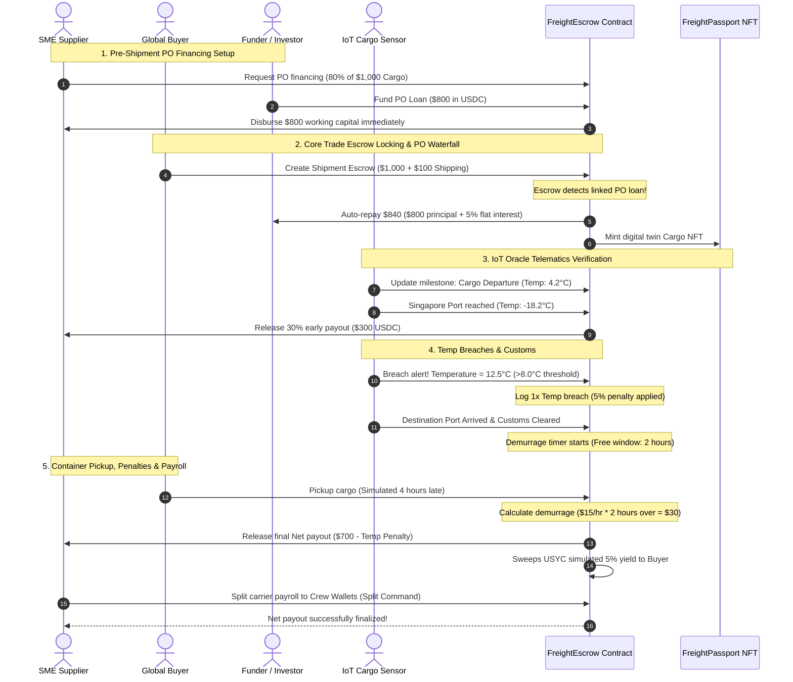
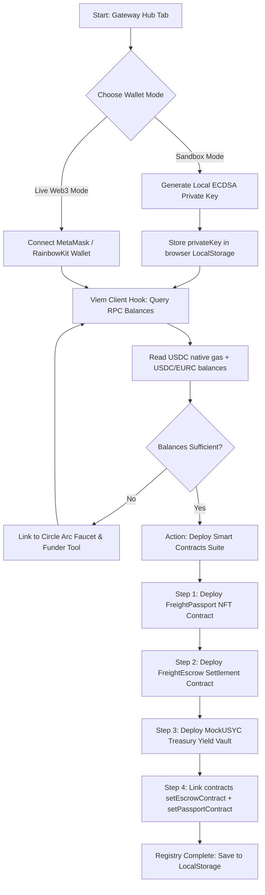
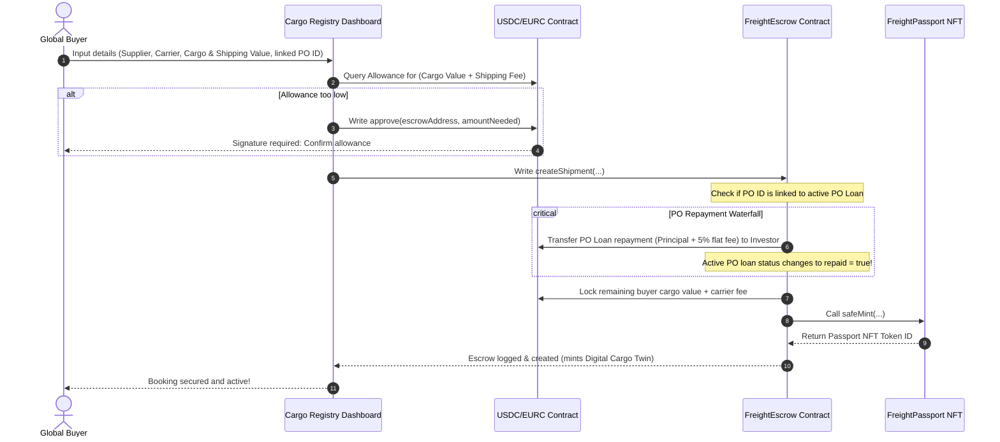
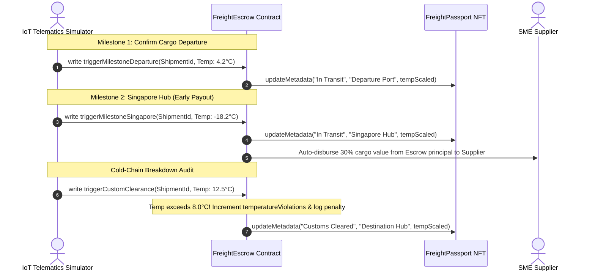
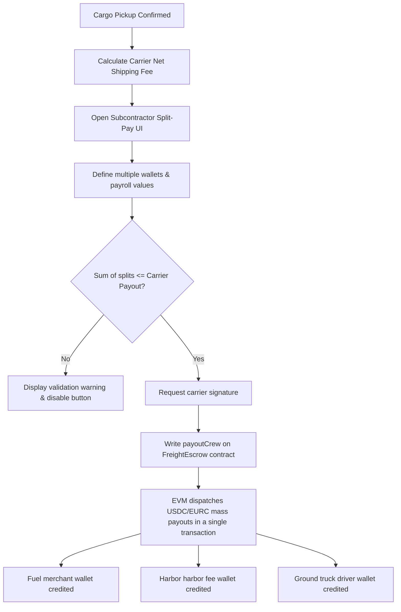
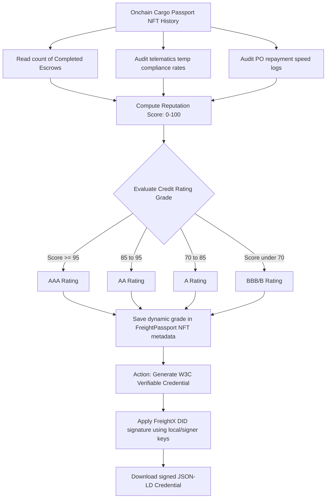
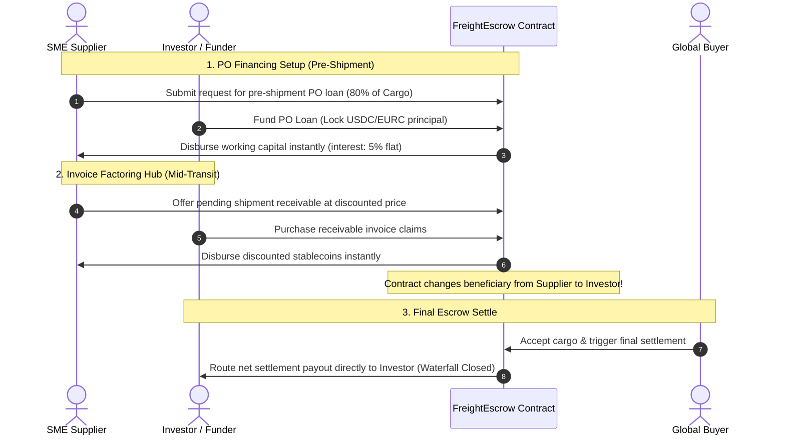

# FreightX — Logistics & Trade Finance Orchestrator

> An end-to-end stablecoin-powered logistics escrow, invoice factoring, and pre-shipment financing platform built on [Arc Network](https://docs.arc.network/) using [Circle's USDC](https://developers.circle.com/stablecoins/what-is-usdc).


---

## 🎯 Problem Statement

International shipping and cross-border trade settlement is throttled by:

- 📑 **Manual Bill-of-Lading Workflows:** Reconciliation across shippers, ports, customs, and carriers takes weeks, relying on physical, forgeable paper slips.
- 💸 **Working Capital Deadlock:** SME suppliers lock up $30K–$500K for 30–90 days waiting for sluggish bank Letters of Credit (L/C) processing.
- 🧊 **Cold-Chain Vulnerability:** High-value perishables (frozen food, pharmaceuticals) go bad during transit without automated compliance tracking, leading to legal disputes.
- ⏳ **Demurrage Extortion:** Late cargo pickup triggers astronomical port storage penalties that are manual, delayed, and easy to manipulate.
- 🏦 **Expensive Intermediaries:** Traditional bank letters of credit cost 1.5%–3% of total cargo value and take 5–15 business days to clear.

---

## 💡 The FreightX Solution

FreightX replaces legacy trade finance infrastructure with **programmable stablecoin escrows on Arc L1**, enabling sub-second finality and native gas simplicity:

- 🤝 **Smart Contract Escrows:** Buyer funds are locked on-chain in USDC or EURC, auto-released securely as milestones are cleared.
- ⚡ **Singapore Port Checkpoint Milestone:** Automatically disburse 30% of locked supplier capital as soon as cargo passes the Singapore Transshipment Hub, boosting working capital mid-transit.
- 📊 **Pre-Shipment PO Financing:** Suppliers auction purchase orders to investors for up to 80% advance financing at a fixed 5% interest, with settlement automated via incoming buyer escrow deposits.
- 📈 **Invoice Factoring Hub:** Shippers sell pending cargo receivables at a minor discount to unlock immediate operating liquidity. Payout beneficiaries are transparently redirected on-chain.
- 🌡️ **IoT Climate Oracle & Automatic Penalties:** Real-time container telemetry feeds directly to contracts. Breach of safe cold-chain thresholds (>8.0°C) triggers instant 5% supplier payouts cuts.
- ⏱️ **Time-Accelerated Demurrage Timers:** Timers start immediately upon Customs Clearance. Storage penalties are automatically computed and subtracted from the carrier payout on container pickup.
- 🎟️ **Cargo Digital Twin Passport:** Every shipment mints an ERC-721 NFT passport logging immutable on-chain history (location, transit status, temperature logs, and cryptographic validator signatures).

---

## 🏗 System Architecture & Smart Contract Flow

FreightX uses a robust client-blockchain model built with Next.js 15, Viem, and custom Solidity contracts deployed to Arc Network.

### Component Map
```
┌──────────────────────────────────────────────────────────────────────────────┐
│                            FreightX Platform (Frontend)                      │
├──────────────────────────┬───────────────────────────────────────────────────┤
│    Next.js 15 App        │     Solidity Smart Contracts (Arc Testnet)        │
│                          │                                                   │
│   ┌───────────────┐      │     ┌──────────────────┐    ┌──────────────────┐  │
│   │ Escrow Manager│──────┼────►│ FreightEscrow.sol│◄──►│FreightPassport.sol│ │
│   │ IoT Simulator │      │     │  • USDC/EURC Lock│    │  • ERC-721 NFT   │  │
│   │ PO Financing  │      │     │  • Milestones    │    │  • Cargo History │  │
│   │ Credit Passport│     │     │  • Demurrage Calc│    │  • Temp Telemetry│  │
│   │ Crew Payroll  │      │     │  • PO Waterfall  │    │  • Status Updates│  │
│   │ StableFX Calc │      │     │  • Invoice Factor│    │                  │  │
│   └───────────────┘      │     └──────────────────┘    └──────────────────┘  │
├──────────────────────────┴───────────────────────────────────────────────────┤
│                           Arc Network L1 Blockchain                          │
│        USDC Native Gas   •   Sub-Second Finality   •   USDC/EURC ERC-20      │
└──────────────────────────────────────────────────────────────────────────────┘
```

### End-to-End Workflow Sequence



---

## 🔄 Core Tab Workflows (Detailed Mermaid Flowcharts)

To make it easy to audit the business logic, state transitions, and smart contract methods behind the dashboard interfaces, each of the 6 core tabs is mapped to its exact workflow below:

### 1. 🌐 Gateway Hub (Onchain Sandbox)
Manages localized key generation, Web3 provider handshakes, RPC querying, and contract compilations/deployments client-side to ensure the sandbox is fully operable:



### 2. 🤝 Escrow Shipments (Cargo Registry)
Handles buyer-supplier cargo escrows, token allowance checks, Purchase Order linking, and digital-twin cargo NFT creation:



### 3. 🌡️ IoT Tracking (Climate Telemetry & Milestones)
Monitors physical transit checkpoints, implements cold-chain temperature thresholds, and triggers early milestone payouts or compliance cuts:



### 4. 💸 Instant Payroll (Mass Carrier Split-Pay)
Carrier dispatchers programmatically split their net logistics payouts among ground drivers, harbor authorities, toll agencies, and subcontractors:



### 5. 🪪 Reputation Passports (Enterprise Trust)
Processes historical trade performance and telemetry data to generate digital grade passports and export cryptographic credentials:



### 6. 📈 Capital Marketplace (Receivables Factoring & POs)
Suppliers list pending cargo invoices for auction and request purchase order working capital to finance production:



---

## 🔗 Live Deployed Contracts on Arc Testnet

FreightX is fully deployed and verified on the **Arc Testnet L1 Network**:

- 📜 **FreightEscrow Core:** [`0xe6a4be867a1e798508a744ff115a95890afbbd45`](https://testnet.arcscan.app/address/0xe6a4be867a1e798508a744ff115a95890afbbd45)
- 🎟️ **FreightPassport (ERC-721):** [`0xa106b3548e8d7bed77d984c1d6f9d60798bb87b0`](https://testnet.arcscan.app/address/0xa106b3548e8d7bed77d984c1d6f9d60798bb87b0)
- 💵 **USDC (Native Arc Gas Token):** [`0x3600000000000000000000000000000000000000`](https://testnet.arcscan.app/token/0x3600000000000000000000000000000000000000)
- 💶 **EURC (Multi-currency ERC-20):** [`0x89B50855Aa3bE2F677cD6303Cec089B5F319D72a`](https://testnet.arcscan.app/token/0x89B50855Aa3bE2F677cD6303Cec089B5F319D72a)

---

## ✨ Key Features Breakdown

### 🏢 B2B Trade & Finance Workflow
- **Multi-Asset Support:** Escrows can be settled in either standard **USDC** or **EURC** to accommodate both transatlantic and transpacific SME trading routes.
- **Milestone Payout Waterfall:** Avoid locking liquidity point-to-point. A configurable 30% of locked funds is automatically routed to the supplier upon passing mid-transit hub checkpoints.
- **USYC Treasury Account Sweep:** Escrowed principal is deposited directly into a simulated 5% APY Treasury Account (USYC) for the duration of shipping. Accumulated yield is credited as a rebate back to the buyer upon final delivery.

### ⏱️ Demurrage Acceleration Engine
- Configurable free hours discharge window and progressive penalty pricing.
- Interactive time-speed simulation dials up time elapsed, providing realistic penalties on container retrieval.
- Auto-reconciliation of storage penalties paid by the carrier before final cargo release is permitted.

### 📈 Invoice Factoring Hub & PO financing
- **SME Capital Pre-Funding:** Suppliers request PO loans. External funders deploy USDC/EURC, capturing a stable, guaranteed 5% flat return.
- **Invoice Factoring:** Suppliers list pending trade invoices on an open claims directory. Investors acquire invoice claims at a minor discount, redirecting the final payout to the investor's wallet.

### 🎓 SME Credit Passport (W3C Verifiable Credentials)
- Analyzes on-chain metadata including completed contracts count, reputation compliance score, and PO repayment speed to calculate an enterprise grade (AAA, AA, A, BBB, B).
- **1-Click VC Export:** Generates W3C-compliant cryptographic Verifiable Credentials (signed JSON-LD format) for suppliers, carriers, and buyers to prove reputation off-chain.

---

## 🛠 Circle Commerce Stack & Arc Integrations

| Technology | Implementation | Impact |
|------------|----------------|--------|
| **Circle USDC** | Deployed as the primary gas and payment asset on Arc. | Guarantees stable-value escrows, eliminates gas volatility, and achieves transaction completion in <1 second. |
| **Circle EURC** | Active alternative token settlement system. | Enables seamless multi-currency support for Euro corridor shipping routes without FX exposure. |
| **StableFX Bridge** | Integrated AED currency rate calculator. | Translates Middle Eastern regional cargo value demands directly into digital USD equivalent values instantly. |
| **USYC Integration** | Sweep deposits into automated yield account. | Captures dynamic treasury returns during active shipping timeframes, adding a 5% APY yield utility to idle cargo capital. |

---

## 🚀 Getting Started

### Prerequisites
- Node.js 18.0 or higher
- npm or yarn

### Installation

1. **Clone the repository:**
   ```bash
   git clone <repository-url>
   cd FreightX
   ```

2. **Install dependencies:**
   ```bash
   npm install
   ```

3. **Run local developer server:**
   ```bash
   npm run dev
   ```
   Open [http://localhost:3000](http://localhost:3000) to view the FreightX console dashboard.

---

## 🧪 Comprehensive End-to-End Walkthrough

You can test the entire workflow in **Local Simulation Mode** (no wallet or gas required) or **Live Chain Mode** (Arc Testnet):

### Phase 1: Pre-Shipment PO Financing
1. Go to the **Capital Marketplace** tab.
2. Under "Apply for Pre-Shipment Capital", enter a Buyer Address, target Cargo Value, and Loan Amount. Click **Submit Request**.
3. In the "Active PO Loans Board" table, click **Fund PO Loan** to simulate an investor providing liquidity.
4. The status updates to **Capital Disbursed**. The supplier has unlocked operational liquidity!

### Phase 2: Booking the Cargo Escrow
1. Go to the **Cargo Registry** (or Escrow Shipments tab).
2. Click **Book New Container Escrow**.
3. Check the **Link to Active PO Loan** box, and select the PO Loan ID you created in Phase 1.
4. Input route parameters (e.g., Singapore Port, Shenzhen, LA Port) and click **Create Secured Escrow**.
5. *Waterfall Check:* The smart contract automatically locks the buyer's deposit and instantly routes the principal + 5% interest payment back to the Funder's wallet, closing the PO loan cycle!

### Phase 3: Telematics Tracking & IoT Milestones
1. Select your cargo in the **Cargo Registry** and click **Track Shipments** to load the IoT telemetry dashboard.
2. Under "Milestone Checkpoints", click **Confirm Departure** to start cargo transit.
3. Next, click **Arrived at Singapore Hub**. *Milestone Check:* 30% of the supplier cargo funds are released instantly mid-journey to support carrier fuel/toll cash flow.
4. Adjust the **Temperature Controller Slider** above 8.0°C to simulate a cold-chain breakdown. The sensor warns you of a breach and automatically docks a penalty from the final supplier payout.

### Phase 4: Customs, Demurrage, and Split Payroll
1. Click **Confirm Arrival** and then **Confirm Customs Clearance**.
2. *Demurrage Clock:* Since customs is cleared, container pickup has a free time window (e.g., 2 hours).
3. Use the **Time Accelerator dial** to speed up simulated hours.
4. Click **Accept Container & Trigger Final Settlement**. Any demurrage penalties are calculated and adjusted automatically.
5. In the **Subcontractor Split Payroll** card, click **Disburse Multi-Party Split Pay** to split the carrier's fee instantly among truck drivers, harbor tolls, and fuel suppliers.

---

## 📄 W3C Verifiable Credential Example

Upon successful delivery, suppliers, buyers, and carriers can export verified credit score credentials. Below is a sample payload exported by the dashboard:

```json
{
  "@context": [
    "https://www.w3.org/2018/credentials/v1",
    "https://schema.org"
  ],
  "id": "urn:uuid:f5b128c9-de3a-4b08-8e6d-6254a6bc7a89",
  "type": ["VerifiableCredential", "TradeReputationCredential"],
  "issuer": "did:web:freightx.network",
  "issuanceDate": "2026-05-25T09:30:00Z",
  "credentialSubject": {
    "id": "did:ethr:0x8d92F677cD6303Cec089B5F319D72aA797da53",
    "legalName": "SME Logistics Ltd",
    "role": "Supplier",
    "reputationScore": 98,
    "creditRatingGrade": "AAA",
    "totalVolumeSettled": "285,000 USDC",
    "completedContractsCount": 32,
    "telematicsCompliance": "99.2%",
    "poRepaymentRate": "100%"
  },
  "proof": {
    "type": "JsonWebSignature2020",
    "created": "2026-05-25T09:31:00Z",
    "proofPurpose": "assertionMethod",
    "verificationMethod": "did:web:freightx.network#key-1",
    "jws": "eyJhbGciOiJSUzI1NiIsImI2NCI6ZmFsc2UsImNyaXQiOlsiYjY0Il19...xyz"
  }
}
```

---

## 💬 Circle Product & Arc Developer Feedback

### 🌟 What Worked Well
1. **Deterministic Gas System:** Arc's dollar-denominated USDC-as-gas fees made platform integrations incredibly easy. We could precisely calculate transaction costs for global SMEs without fluctuating gas spikes.
2. **Sub-second Finality:** The speed of the Arc L1 network is transformative for logistics. Milestone payouts (like Singapore Hub clearance) confirm instantly on-chain, matching real-world freight processing speed.
3. **EVM Compatibility:** Deployed standard Solidity contracts without changing code. Standard tools like `viem` and `wagmi` worked seamlessly with Arc endpoints.

### 💡 Suggested Improvements
1. **EURC Faucet Simplification:** While the USDC faucet worked flawlessly, accessing testnet EURC required multiple manual steps. A unified testnet faucet dispensing all Circle assets would streamline multi-currency tests.
2. **StableFX API Access:** Enterprise gates limited live FX integrations. Opening a public sandbox StableFX API with mock rates would let hackathon developers build real-time FX-aware escrow systems.
3. **Automated Verification:** Support for automatic programmatic contract verification via standard API tooling on ArcScan explorer would enhance contract deployment pipelines.

---

## 📜 License

MIT License. Designed and built for the **Agora Hackathon — USDC Commerce Stack Challenge**.
